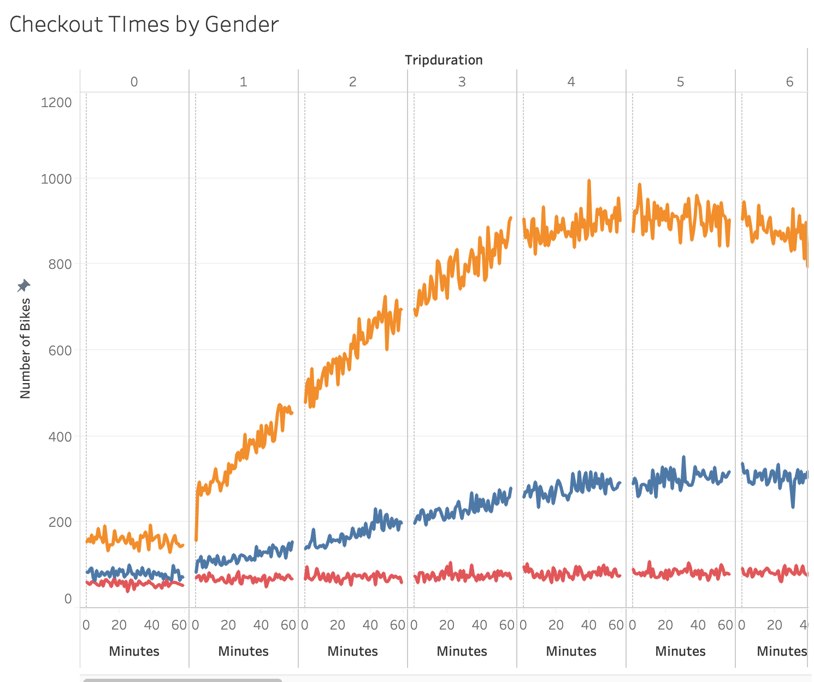

# bikesharing

## Overview of the Analysis  
The purpose of this project is to convince investors to invest in a bikeshare business in Des Moines, Iowa that is similar to Citibike. This is done through conducting data analysis on citibikes during August of 2019. 

## Results
Through my results, I found out that the fifth hour of the day is when the checkout Times for users is the most popular. I also found that out of all genders, males checkout citibikes the most and they checkout their bikes the most at around sometime between the fourth and fifth hour of the day. 

## Summary 
Two additional visualizations I would provide with this result would be to create a pie chart that shows total number of bikers separated into usertype, showing whether a person is a subscriber or customer and how many of them within each usertype is female, male, or unknown. Another visual I could create would be a line graph showing the count of bikers on the x axis and  distance for biking in the y axis. 

## Images

Checkout Times for Users 

Checkout Times by Gender

